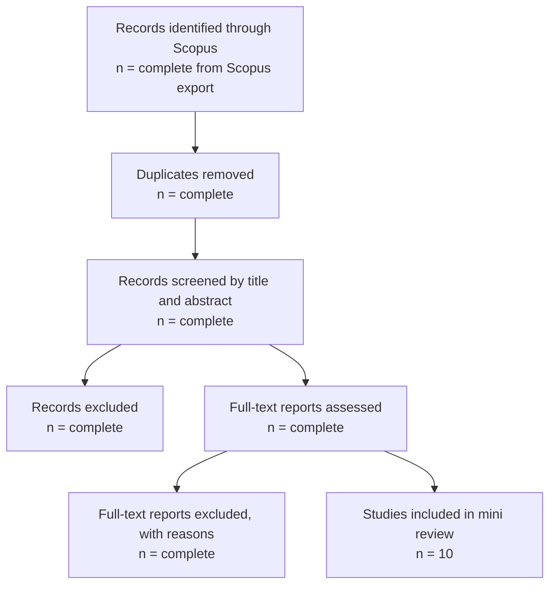

# 04_LITERATURE — Mini Systematic Review

## Research title
**Digital Transformation and Its Impact on the Quality and Efficiency of Higher Education: A Case Study of the Universidad Nacional Mayor de San Marcos**

## 1. Review purpose
This mini systematic review synthesizes recent research on digital transformation in higher education, emphasizing educational quality, institutional efficiency, digital maturity, governance, organizational capabilities, barriers, and stakeholder experience.

## 2. Review question
**What does the recent Scopus-indexed literature report about the influence of digital transformation on educational quality and institutional efficiency in higher education institutions, and which gaps remain relevant to a case study of the Universidad Nacional Mayor de San Marcos?**

## 3. Reporting framework
The review follows PRISMA 2020. Before formal submission, the documented search should be rerun in the institutional Scopus account to verify current source coverage and replace provisional screening counts with the exact exported results.

## 4. Database and search strategy

### Database
- Scopus
- Search field: Title, abstract, and keywords
- Period: 2021–2026
- Languages: English and Spanish
- Document type: Article or review
- Source type: Journal

### Search string
```text
TITLE-ABS-KEY(
  ("digital transformation" OR digitalisation OR digitalization OR "digital maturity")
  AND
  ("higher education" OR universit* OR "higher education institution*")
  AND
  (quality OR "educational quality" OR efficiency OR performance
   OR governance OR management OR "student experience")
)
AND PUBYEAR > 2020
AND PUBYEAR < 2027
AND (LIMIT-TO(DOCTYPE, "ar") OR LIMIT-TO(DOCTYPE, "re"))
AND (LIMIT-TO(SRCTYPE, "j"))
AND (LIMIT-TO(LANGUAGE, "English") OR LIMIT-TO(LANGUAGE, "Spanish"))
```

## 5. Eligibility criteria

### Inclusion
1. Peer-reviewed journal article or review published from 2021 to 2026.
2. Journal indexed in Scopus at the time of verification.
3. Direct focus on universities or higher education institutions.
4. Digital transformation treated as an organizational, academic, managerial, or governance process.
5. Findings relevant to quality, efficiency, performance, maturity, barriers, leadership, competence, or stakeholder experience.

### Exclusion
1. Studies focused only on schools or corporate training.
2. Emergency remote teaching papers without an institutional transformation perspective.
3. Purely technical system papers without educational or organizational outcomes.
4. Conference papers, editorials, theses, book chapters, or grey literature.
5. Publications before 2021.
6. Duplicate or methodologically insufficient records.

## 6. PRISMA 2020 flow diagram



## 7. Final sample of ten papers

| No. | Reference | Design / scope | Main contribution | Relevance to UNMSM |
|---:|---|---|---|---|
| 1 | Alhubaishy, A., & Aljuhani, A. (2021). *The challenges of instructors’ and students’ attitudes in digital transformation: A case study of Saudi universities*. **Education and Information Technologies, 26**, 4647–4662. https://doi.org/10.1007/s10639-021-10491-6 | University case study | Stakeholder attitudes, readiness, and resistance influence implementation. | Supports measurement of human and cultural factors. |
| 2 | Mhlanga, D., Denhere, V., & Moloi, T. (2022). *COVID-19 and the key digital transformation lessons for higher education institutions in South Africa*. **Education Sciences, 12**(7), 464. https://doi.org/10.3390/educsci12070464 | Contextual review | Infrastructure, inequality, skills, and resilience are central transformation issues. | Provides a Global South comparison. |
| 3 | Fernández, A., Gómez, B., Binjaku, K., & Kajo Meçe, E. (2023). *Digital transformation initiatives in higher education institutions: A multivocal literature review*. **Education and Information Technologies**. https://doi.org/10.1007/s10639-022-11544-0 | Multivocal review | Many universities implement isolated initiatives without an integrated strategy. | Justifies evaluating strategy alignment and digital maturity. |
| 4 | Alenezi, M., & Akour, M. (2023). *Digital transformation blueprint in higher education: A case study of PSU*. **Sustainability, 15**(10), 8204. https://doi.org/10.3390/su15108204 | Institutional case study | Links leadership, infrastructure, people, processes, and governance. | Offers dimensions for the UNMSM framework. |
| 5 | Gkrimpizi, T., Peristeras, V., & Magnisalis, I. (2023). *Classification of barriers to digital transformation in higher education institutions: Systematic literature review*. **Education Sciences, 13**(7), 746. https://doi.org/10.3390/educsci13070746 | Systematic review | Classifies strategic, organizational, technological, cultural, and competence barriers. | Supports survey and interview instrument design. |
| 6 | Farias-Gaytan, S., Aguaded, I., & Ramírez-Montoya, M.-S. (2023). *Digital transformation and digital literacy in the context of complexity within higher education institutions: A systematic literature review*. **Humanities and Social Sciences Communications, 10**, 386. https://doi.org/10.1057/s41599-023-01875-9 | Systematic review | Connects digital literacy, complexity, institutional change, and innovation. | Supports digital competence as an enabling condition. |
| 7 | Díaz-García, V., Montero-Navarro, A., Rodríguez-Sánchez, J.-L., & Gallego-Losada, R. (2023). *Managing digital transformation: A case study in a higher education institution*. **Electronics, 12**(11), 2522. https://doi.org/10.3390/electronics12112522 | Qualitative case study | Highlights participatory leadership, stakeholder involvement, and change management. | Provides a close methodological precedent. |
| 8 | Gkrimpizi, T., Peristeras, V., & Magnisalis, I. (2024). *Defining the meaning and scope of digital transformation in higher education institutions*. **Administrative Sciences, 14**(3), 48. https://doi.org/10.3390/admsci14030048 | Conceptual study | Distinguishes digitization, digitalization, and digital transformation. | Prevents reduction of transformation to technology adoption. |
| 9 | Singun, A. J. (2025). *Unveiling the barriers to digital transformation in higher education institutions: A systematic literature review*. **Discover Education, 4**, 37. https://doi.org/10.1007/s44217-025-00430-9 | PRISMA systematic review | Identifies nine barrier dimensions, including ethics and stakeholder management. | Provides an updated barrier matrix. |
| 10 | Tang, J., Huang, P. H., & Yan, S. Y. (2025). *Digital transformation in higher education: Logical framework, practical dilemmas, and implementation approaches*. **Frontiers in Psychology, 16**, 1565591. https://doi.org/10.3389/fpsyg.2025.1565591 | Qualitative multi-case analysis | Proposes value, technological, and practical logics and identifies dilemmas. | Helps explain mechanisms linked to quality. |

## 8. Thematic synthesis

### Theme 1: Digital transformation is organizational
The literature distinguishes genuine transformation from simple digitization. Strategic alignment, leadership, governance, process redesign, culture, data use, and stakeholder engagement are central.

### Theme 2: Educational quality requires pedagogical integration
Technology contributes to quality when it supports pedagogical innovation, access, faculty development, student engagement, and feedback. Digital literacy is an enabling condition.

### Theme 3: Institutional efficiency is under-measured
Efficiency is often asserted rather than measured. Objective indicators such as processing time, cost, errors, response time, resource utilization, and productivity remain scarce.

### Theme 4: Leadership, governance, and culture shape outcomes
Participatory leadership, coherent strategy, institutional coordination, and change management repeatedly emerge as critical.

### Theme 5: Emerging contexts face distinctive constraints
Global South studies emphasize inequality, legacy systems, budget limitations, restricted digital skills, resistance, and governance challenges.

## 9. Gap analysis

| Gap | Current evidence | Remaining limitation | Response proposed for UNMSM |
|---|---|---|---|
| Conceptual | Definitions and maturity dimensions | Confusion among digitization, digitalization, and transformation | Use a multidimensional definition |
| Outcome | Claims about quality and efficiency | Few studies measure both simultaneously | Treat both as separate outcome constructs |
| Causal | Reviews and cross-sectional designs | Weak causal or mechanism evidence | Use comparative or quasi-experimental mixed methods |
| Measurement | Maturity and perception scales | Few objective operational indicators | Combine surveys and institutional metrics |
| Mechanism | Leadership, culture, skills identified | Limited mediation or moderation analysis | Examine organizational, human, and technological mechanisms |
| Context | Evidence from Europe, Asia, and developed systems | Scarce Latin American public-university evidence | Produce an UNMSM case study |
| Stakeholder | Single-population studies | Limited stakeholder integration | Include students, faculty, administrators, and managers |
| Method | Quantitative or qualitative methods separately | Limited integration | Apply explanatory mixed methods |
| Temporal | Mostly cross-sectional | Limited pre/post evidence | Use retrospective and pre/post indicators when feasible |
| Practical | General strategy recommendations | Few prioritized institutional roadmaps | Produce an evidence-based UNMSM roadmap |

## 10. Research gap statement

Despite growing research on digital transformation in higher education, evidence remains fragmented regarding its simultaneous influence on educational quality and institutional efficiency. Existing studies commonly focus on maturity, barriers, or stakeholder perceptions, while objective performance indicators and explanatory mechanisms are less frequently examined. The literature is also dominated by contexts outside Latin America. A mixed-methods case study at UNMSM can therefore contribute by integrating multidimensional measures of transformation, educational quality, operational efficiency, organizational capabilities, and stakeholder perspectives.

## 11. Proposed conceptual implications

Digital transformation should be treated as the explanatory construct, while educational quality and institutional efficiency operate as outcome constructs. Leadership, governance, organizational culture, digital competence, infrastructure, and stakeholder engagement should be considered dimensions, mediators, moderators, or contextual conditions.

## 12. Quality appraisal

Score each criterion as 0 = not met, 1 = partially met, or 2 = fully met:

1. Clear objective.
2. Appropriate design.
3. Transparent sample or search process.
4. Valid data collection.
5. Adequate analysis.
6. Findings supported by evidence.
7. Limitations discussed.
8. Context clearly described.
9. Relevance to quality or efficiency.
10. Direct relevance to higher education digital transformation.

Maximum score: 20. Suggested inclusion threshold: 14/20.

## 13. Conclusion

The literature suggests that digital transformation can strengthen educational quality and institutional efficiency, but success depends on strategy, governance, leadership, culture, competence, infrastructure, and stakeholder participation. The most important gap is the lack of integrated empirical models that combine objective and perceptual indicators in large public universities from Latin America.

## 14. PRISMA reference

Page, M. J., McKenzie, J. E., Bossuyt, P. M., Boutron, I., Hoffmann, T. C., Mulrow, C. D., et al. (2021). The PRISMA 2020 statement: An updated guideline for reporting systematic reviews. *BMJ, 372*, n71. https://doi.org/10.1136/bmj.n71
